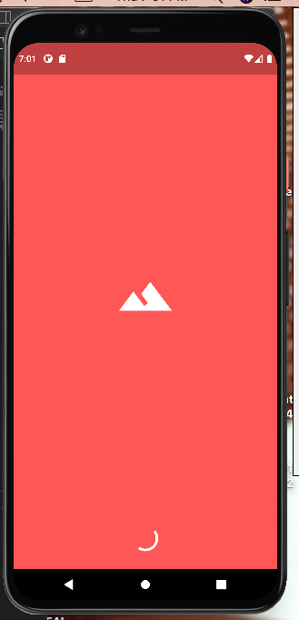
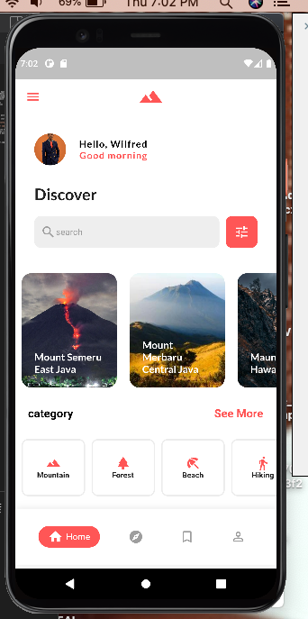
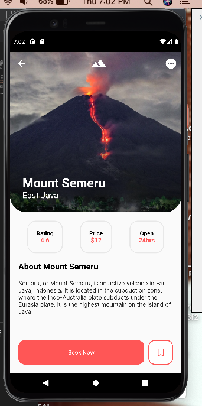

# splash_screen

Overview

- A simple 3-pages flutter Application/ Mounts of the world (Splash       - screen,landing page and Details page)
- Common flutter layout strategies using just core widget
- Creating custom flutter widgets and achieve widget composition
- Creating Dart models to mock up app data
- Import network images
- using Material icon fonts
- Basic Navigation strategies

A new Flutter project.

## Getting Started

This project is a starting point for a Flutter application.

A few resources to get you started if this is your first Flutter project:

- [Lab: Write your first Flutter app](https://docs.flutter.dev/get-started/codelab)
- [Cookbook: Useful Flutter samples](https://docs.flutter.dev/cookbook)

For help getting started with Flutter development, view the
[online documentation](https://docs.flutter.dev/), which offers tutorials,
samples, guidance on mobile development, and a full API reference.

## Screen images

